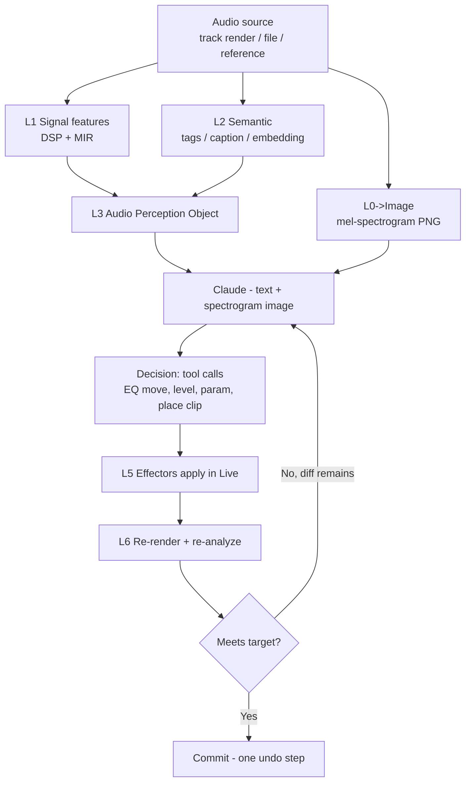
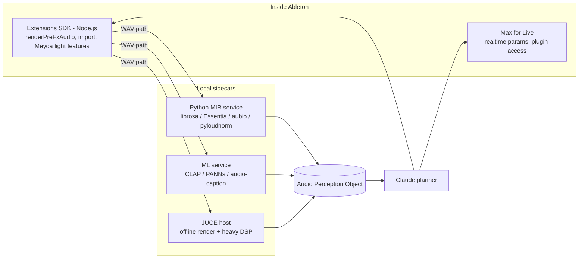

# Audio Awareness for LLMs — Technical Spec Sheet

**Context:** AI-assisted Ableton Live tooling (Extensions SDK + Max for Live + JUCE).
**Scope:** How to make an LLM (Claude) *perceive* audio well enough to mix, master, sound-match, and arrange.
**Version:** 0.1 (design)

---

## 0. Founding principle

> **LLMs do not hear. They reason over representations.**

Claude accepts **text and images**, not raw audio (no native waveform/PCM input). Therefore "audio
awareness" = a **perception layer** that converts audio into LLM-legible artifacts:

1. **Numbers** — DSP/MIR features (loudness, spectrum, dynamics, stereo, transients…)
2. **Tags** — semantic labels (instrument, genre, mood) from audio classifiers
3. **Captions** — natural-language descriptions from audio-native models
4. **Images** — mel-spectrograms / waveforms fed to Claude's **vision** input (the most direct multimodal path for Claude)
5. **Embeddings** — for similarity search against a reference library (converted to text before the LLM sees them)

The LLM's job is **judgment and planning over these representations**, not signal processing.

---

## 1. The audio-awareness stack

| Layer | Name | Responsibility | Where it runs |
|------|------|----------------|---------------|
| L0 | Capture | Get audio to analyze | Extensions SDK `renderPreFxAudio`; JUCE offline bounce; file import |
| L1 | Signal features | DSP/MIR feature extraction | Node (Meyda) for light; Python sidecar (librosa/Essentia) or JUCE for heavy |
| L2 | Semantic understanding | Tagging, captioning, embeddings | Python ML sidecar / hosted model (CLAP, PANNs, audio-LLM) |
| L3 | Representation | Serialize into the **Audio Perception Object** | Node core |
| L4 | Reasoning | LLM decides moves via tool-use | Claude |
| L5 | Action | Apply via effector adapters | SDK / M4L / JUCE |
| L6 | Verification | Re-render, re-analyze, compare to intent/target | Loop back to L0 |

---

## 2. Closed perception → action → verification loop



---

## 3. The Audio Perception Object (APO)

The single contract between perception and the LLM. **Compact, labeled, diff-oriented.** Never feed raw
arrays — feed summaries with plain-language descriptors and, where relevant, **deltas vs. a target/reference**.

```jsonc
{
  "source": { "kind": "track_render", "trackName": "Lead Vox", "startBeat": 0, "endBeat": 64, "sampleRate": 48000, "durationSec": 32.0 },

  "loudness": {
    "integratedLUFS": -18.3, "shortTermMaxLUFS": -14.1, "truePeakDb": -0.8,
    "loudnessRangeLU": 9.2, "rms": -20.4, "crestFactor": 14.6,
    "verdict": "quiet and dynamic; peaks near 0 dBTP risk on summing"
  },

  "spectrum": {
    "bandsDb": { "sub_20_60": -28, "low_60_120": -14, "lowmid_120_400": -8,
                 "mid_400_2k": -10, "highmid_2k_6k": -12, "air_6k_20k": -22 },
    "centroidHz": 1850, "rolloff85Hz": 6400, "flatness": 0.12,
    "verdict": "boomy 120-400 Hz buildup; dull above 6 kHz"
  },

  "stereo": { "widthPct": 35, "correlation": 0.78, "monoCompatible": true,
              "sideEnergyByBand": { "low": 0.05, "mid": 0.30, "high": 0.55 } },

  "dynamics": { "transientDensity": 2.1, "attackMs": 12, "percussiveness": 0.3,
                "pumping": false },

  "musical": { "bpm": 120.0, "key": "A minor", "keyConfidence": 0.82,
               "onsetsPerSec": 2.1, "voicedRatio": 0.9 },

  "quality": { "clippingPct": 0.0, "dcOffset": 0.0001, "noiseFloorDb": -62,
               "phaseIssues": false },

  "semantic": { "instrument": ["female vocal"], "genre": ["pop", "rnb"],
                "mood": ["intimate", "warm"], "tagConfidence": 0.74,
                "caption": "A close-mic'd female vocal, warm and slightly boomy, light room reverb." },

  "similarity": { "nearestReferences": [
        { "name": "ref_pop_vox_A", "distance": 0.11, "note": "brighter, tighter low-mids" } ] },

  "spectrogramImageRef": "tmp://leadvox_mel.png",

  "targetDelta": {                         // present only when a target/reference exists
    "integratedLUFS": "+4.3 to reach -14",
    "lowmid_120_400": "-5 dB to match reference",
    "air_6k_20k": "+6 dB to match reference"
  }
}
```

**Design rules for the APO**
- **Absolute + delta.** Always include the move relative to target — the LLM reasons far better on "cut 5 dB at 250 Hz" than on raw band values.
- **Verdict strings.** Pre-chew each section into one human sentence; cheap to compute, hugely improves LLM grounding.
- **Confidence everywhere.** Tag/key/caption confidences let the LLM hedge instead of hallucinating certainty.
- **Token budget.** Whole-track APO ≈ 300–600 tokens. For arrangement, emit one slim APO per section (intro/verse/chorus), not per frame.
- **Per-track + bus.** For mixing, include a small **cross-track masking matrix** (band-overlap between tracks) so the LLM can carve frequencies.

---

## 4. Feature catalog (L1/L2)

| Feature | Why the LLM needs it | Use cases | Library |
|--------|----------------------|-----------|---------|
| Integrated/short-term LUFS, true peak | loudness targets, headroom | master, mix | ffmpeg ebur128, pyloudnorm, libebur128 |
| LRA, crest factor, PLR | how much compression/limiting | master, mix | Essentia, custom |
| Band energies (log bands) | EQ decisions | mix, master, match | Meyda, librosa STFT |
| Spectral centroid/rolloff/flatness | brightness, tonal balance, noisiness | match, mix | Meyda, librosa, Essentia |
| Spectral flux / onsets | transients, rhythm, arrangement edits | arrange, mix | aubio, librosa |
| Stereo width / correlation / mid-side | width, mono-compat | master, mix | custom DSP, Essentia |
| BPM + beat grid | quantize, place clips on grid | arrange | aubio, librosa, Essentia |
| Key / chroma | harmonic-aware MIDI + matching | arrange, sound design | Essentia (Krumhansl), librosa |
| Clipping / DC / noise floor / phase | quality gate before acting | all | custom DSP |
| Cross-track band overlap (masking) | frequency carving across mix | mix | derived from band energies |
| Instrument/genre/mood tags | semantic intent, presets | match, arrange | PANNs, YAMNet, CLAP |
| Audio caption | one-line semantic grounding | match, mix | Qwen2-Audio, LP-MusicCaps, audio-LLM |
| Audio embedding (CLAP/OpenL3) | nearest-reference retrieval | match, master targets | CLAP, OpenL3 |
| Mel-spectrogram PNG | **Claude vision** sees structure directly | all | librosa + matplotlib, JUCE |

---

## 5. Multimodal strategy (the Claude-specific lever)

Claude is **text + vision**, not audio-native. Three ways to grant awareness, often combined:

1. **Spectrogram-to-vision (native to Claude).** Render a labeled mel-spectrogram (and optionally a
   waveform/loudness-over-time plot) to PNG and attach it. Claude can spot resonances, muddy build-ups,
   harsh bands, pumping, and arrangement structure visually. **This is the highest-leverage, lowest-infra option.**
2. **Numeric APO (always).** The structured object in §3 — precise, cheap, deterministic.
3. **Audio-native captioner as a sensor.** Use an audio-in model (Gemini, GPT-4o-audio, Qwen2-Audio) purely
   to emit a caption/tags, then hand that text to Claude as the planner. Treat it as a microphone, not the brain.

Recommended default: **APO (numbers) + labeled mel-spectrogram (image)**. Add a captioner only when semantic
nuance matters (sound-matching, vibe-driven requests).

---

## 6. Per-use-case application

### 6.1 Mixing (stock devices)
- **Perceive:** per-track APO + cross-track masking matrix + bus APO.
- **Reason:** Claude proposes EQ cuts/boosts, comp settings, levels, pan, sends — as deltas.
- **Act:** Extensions SDK inserts EQ Eight / Compressor, `setValue` inside `withinTransaction`.
- **Verify:** re-render bus, re-analyze, compare masking/balance, iterate (L6).

### 6.2 Mastering
- **Perceive:** master-bus APO with LUFS/LRA/true-peak + reference embedding + spectrogram.
- **Reason:** Claude sets tonal/loudness/width *targets* (delta to a reference master).
- **Act:** stock chain (EQ Eight, Glue Comp, Utility, Limiter) via SDK; or JUCE offline host for Ozone/Waves bounce.
- **Verify:** measure final LUFS/dBTP against target; loop until within tolerance.

### 6.3 Sound-matching ("recreate this sound")
- **Perceive:** reference APO (spectrum, envelope, transients, caption, embedding).
- **Reason:** Claude maps features → synth-param targets or sample strategy.
- **Act:** stock synth via M4L; sample → Simpler via SDK; Serum via JUCE render (see architecture diagrams).
- **Verify:** render candidate, compare APO distance to reference, refine.

### 6.4 Arrangement / organization
- **Perceive:** per-section APOs (energy, density, brightness, key) across the timeline.
- **Reason:** Claude identifies sections, suggests structure edits, transitions, MIDI variations.
- **Act:** SDK creates/moves/renames clips, scenes, MIDI notes within a transaction.

---

## 7. Where each component runs



- **Node-only (no install):** Meyda gives RMS, centroid, rolloff, flatness, MFCC, ZCR in-process — enough for a v1.
- **Python sidecar (`child_process`):** full MIR + LUFS. The robust path.
- **ML sidecar/hosted:** tagging, captioning, embeddings.
- **JUCE:** when you must render through plugins or need sample-accurate offline DSP.

---

## 8. Prompt & context strategy

- **System role:** "You are a mix/master engineer. You receive an Audio Perception Object and optionally a
  spectrogram image. Decide concrete moves as tool calls. Reason in deltas. Never invent values not present."
- **Anchoring:** include 2–3 few-shot examples mapping APO → tool calls for consistency.
- **Reference DB:** maintain embeddings of "good" masters/mixes; inject the nearest match as a target so the
  LLM optimizes toward something concrete, not a vibe.
- **Determinism:** keep DSP deterministic; let the LLM own judgment only. Log every APO + decision for replay.
- **Guardrails:** clamp tool-call values to each `DeviceParameter`'s `min`/`max`; reject moves that worsen the
  measured target (verification gate in L6).

---

## 9. Limitations & risks

| Limitation | Impact | Mitigation |
|-----------|--------|-----------|
| Claude has no raw-audio input | Can't "listen" directly | Spectrogram image + numeric APO |
| Captioner models can hallucinate tags | Wrong semantic intent | Confidence thresholds; treat as hints |
| MIR key/BPM detection imperfect | Bad harmonic/grid decisions | Surface confidence; allow user override |
| SDK has no automation envelopes | Static moves only | Use M4L for time-varying automation |
| SDK can't insert 3rd-party plugins | Ozone/Waves/Serum limited | JUCE offline host or M4L on pre-placed instances |
| Latency of full perception loop | Slow interactivity | Cache APOs; analyze only changed regions; light Node features first |

---

## 10. Reusability

The **Perception Service** (L0–L3) is a standalone module with one output contract (the APO) and one optional
image artifact. It feeds the **shared tool registry** from the architecture spec, so every effector lane
(SDK / M4L / JUCE) and every client (in-Live command, Claude Code, MCP) consumes the *same* audio awareness.
Swap analyzers behind the APO; the LLM and effectors never change.

```
audio (any source)
   └─ PerceptionService.analyze(wavPath, { target?, withImage? }) -> AudioPerceptionObject
        └─ consumed by: mixing tool, mastering tool, sound-match tool, arrangement tool
```
