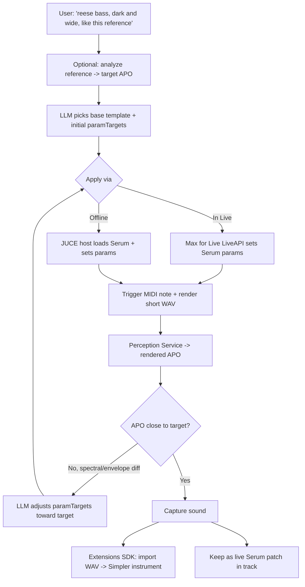
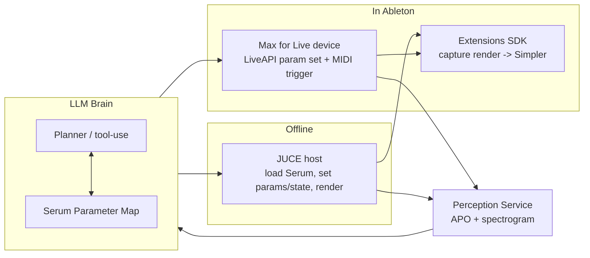

# Controlling Serum with an LLM — Idea Spec

**Status:** idea / design exploration
**Depends on:** `../AUDIO_AWARENESS_SPEC.md` (perception loop), architecture lanes (Extensions SDK / Max for Live / JUCE)
**Target:** Serum 2 (third-party VST/AU synth)

---

## 0. The core problem

Serum is a **third-party plugin**, which means:

- The **Ableton Extensions SDK cannot insert it or load presets** (`insertDevice` is native-only).
- Serum's full state is **not fully exposed as automatable parameters** — continuous knobs (cutoff,
  envelopes, LFO rates, FX, macros, wavetable *position*) are automatable; **structural choices**
  (which wavetable is *loaded*, oscillator type, mod-matrix *routings*) generally are **not**.
- Serum's preset format is **proprietary/undocumented**.

So "LLM controls Serum" is not one capability — it's a **tiered** one, where each tier trades reach for
reliability. The winning move is to let the LLM control what's robustly controllable (automatable params)
and seed structure from a **preset-template library**, all closed inside an **audio-feedback loop**.

---

## 1. Control surfaces available

| Surface | Mechanism | Controls | Reliability |
|--------|-----------|----------|-------------|
| **Max for Live (in Live)** | `LiveAPI` device parameter objects | Serum's automatable params + macros | ✅ Solid for exposed params |
| **JUCE offline host** | Load Serum VST, set params, render MIDI note | Same params + full `setStateInformation` chunk | ✅ params / ⚠️ full state |
| **Extensions SDK** | Cannot drive Serum; **captures the result** | Import rendered WAV → Simpler/clip | ✅ for the sound, not the synth |
| **MIDI CC / NRPN** | Serum's MIDI learn / CC map | Any MIDI-mapped param | ⚠️ setup-dependent |
| **Preset files** | Author/morph `.serum*` preset on disk | Whole patch | ❌ format undocumented |

---

## 2. Tiered control strategy

### Tier 1 — Automatable parameter control (reliable, ship first)
Define a **Serum Parameter Map**: every automatable parameter with name, range, and a one-line semantic
description. The LLM outputs target values; an executor applies them via M4L `LiveAPI` (in Live) or JUCE
(offline). This already covers expressive sound shaping: filter, envelopes, LFOs, unison, FX, macros,
wavetable position.

### Tier 2 — Preset-template morphing (reliable + expressive, ship second)
Maintain a curated library of **base Serum presets** tagged by character (e.g. `growl_bass`, `lush_pad`,
`pluck`, `supersaw`). The LLM:
1. Picks the closest base template to the request (the user/host loads it, or JUCE loads it),
2. Then **morphs the automatable params** (Tier 1) to hit the brief.
This sidesteps the "can't load wavetables via API" wall — structure comes from the template, expression
from the LLM.

### Tier 3 — Full patch synthesis (research, high-risk)
Author or edit Serum's **preset state chunk** directly and load it via JUCE `setStateInformation`. Requires
reverse-engineering Serum's binary preset/chunk format — undocumented, version-fragile, and may break across
Serum updates. Treat as exploratory; do not depend on it.

### Tier 4 — Closed-loop sound design (the differentiator)
Wrap Tiers 1–2 in the **audio-awareness loop**: render a note → analyze (Audio Perception Object) → compare
to the target sound → LLM adjusts params → repeat until the rendered timbre matches. This is where the LLM
provides real value Serum's own UI can't: **goal-directed, measurable sound design.**

---

## 3. The Serum Parameter Map (LLM control contract)

A schema the LLM reasons over. Keep semantic descriptions — the LLM tunes far better when it knows *what a
param does*, not just its index.

```jsonc
{
  "synth": "Serum 2",
  "parameters": [
    { "id": "A_WTPOS", "name": "Osc A Wavetable Pos", "min": 0, "max": 1,
      "semantic": "scans through the wavetable; higher = brighter/more harmonics" },
    { "id": "FIL_CUTOFF", "name": "Filter Cutoff", "min": 0, "max": 1,
      "semantic": "low-pass brightness; lower = darker" },
    { "id": "FIL_RESO", "name": "Filter Resonance", "min": 0, "max": 1,
      "semantic": "emphasis at cutoff; high = whistly/aggressive" },
    { "id": "ENV1_ATK", "name": "Env1 Attack", "min": 0, "max": 1,
      "semantic": "amp attack time; high = slow swell" },
    { "id": "ENV1_REL", "name": "Env1 Release", "min": 0, "max": 1,
      "semantic": "amp release tail" },
    { "id": "LFO1_RATE", "name": "LFO1 Rate", "min": 0, "max": 1, "semantic": "modulation speed" },
    { "id": "UNISON_DET", "name": "Unison Detune", "min": 0, "max": 1,
      "semantic": "supersaw width; high = wider/thicker" },
    { "id": "MACRO1", "name": "Macro 1", "min": 0, "max": 1, "semantic": "patch-defined; read template note" }
    // ...full automatable set
  ],
  "nonAutomatable": ["wavetable selection", "oscillator type", "mod-matrix routings"],
  "notes": "Structure (wavetable, routings) must come from a base preset template; LLM controls the rest."
}
```

### LLM output (a patch delta)
```jsonc
{
  "baseTemplate": "growl_bass",
  "paramTargets": {
    "FIL_CUTOFF": 0.35, "FIL_RESO": 0.55, "A_WTPOS": 0.62,
    "ENV1_ATK": 0.02, "ENV1_REL": 0.30, "UNISON_DET": 0.45, "MACRO1": 0.7
  },
  "rationale": "Darker cutoff + mid wavetable pos for growl; fast attack, medium release; moderate width."
}
```

The executor clamps each value to the param's `min`/`max` and applies inside one undo step (in Live) or
before render (JUCE).

---

## 4. Closed-loop sound-design flow



---

## 5. Architecture placement



- **In-Live path (M4L):** best for interactive patch tweaking on a live Serum instance; the LLM brain talks
  to the M4L device via Node for Max / WebSocket / OSC.
- **Offline path (JUCE):** best for fast iteration, batch exploration, and capturing the sound to a sample
  without touching the live set.
- **Capture (Extensions SDK):** turns any rendered result into a playable Simpler instrument or clip.

---

## 6. How the LLM gets "ears" on Serum

Reuse the **Audio Perception Object** from `../AUDIO_AWARENESS_SPEC.md`. For sound-matching specifically,
weight these features:

- **Spectrum / wavetable character** — band energies, spectral centroid, flatness (brightness, harmonic content)
- **Envelope** — attack/release times from the amplitude contour
- **Movement** — modulation depth/rate via spectral flux over the note
- **Width** — stereo correlation for unison/supersaw character
- **Mel-spectrogram PNG** — let Claude *see* the wavetable scan and modulation visually

The loop optimizes **APO-distance to the target**, giving measurable convergence rather than vibes.

---

## 7. Limitations & risks

| Risk | Impact | Mitigation |
|------|--------|-----------|
| Not all params automatable | Can't fully design from scratch | Tier 2 preset templates seed structure |
| Serum preset format undocumented | Tier 3 fragile | Treat Tier 3 as research; rely on Tiers 1–2 |
| VST param exposure varies in Live | Some params hidden | Build param map empirically; verify per Serum version |
| Closed-loop latency | Slow interaction | Render short notes; cache APOs; JUCE for speed |
| Serum/JUCE licensing | User must own Serum | Host only the user's licensed install |
| Serum version drift | Param IDs/format change | Pin to a Serum version; version the param map |

---

## 8. Build order (MVP → full)

1. **MVP:** Serum Parameter Map + M4L device that sets params from an LLM `paramTargets` JSON. Manual audition.
2. **+Capture:** Extensions SDK command to render the note and load it into Simpler.
3. **+Perception:** wire the Perception Service so the LLM sees the rendered APO + spectrogram.
4. **+Closed loop:** automatic iterate-to-target sound matching (Tier 4).
5. **+Templates:** preset-template library with semantic tags for Tier 2 morphing.
6. **Research:** Tier 3 preset-chunk authoring via JUCE `setStateInformation` (only if format cracks).

---

## 9. Reusability

The Serum integration is just **one effector behind the shared tool registry**: a `serum.setParams` /
`serum.matchSound` tool whose handler targets either the M4L or JUCE adapter. Swap Serum for any plugin by
supplying a new Parameter Map + template library — the LLM brain, Perception Service, and capture path are
unchanged. The synth becomes a pluggable backend.
