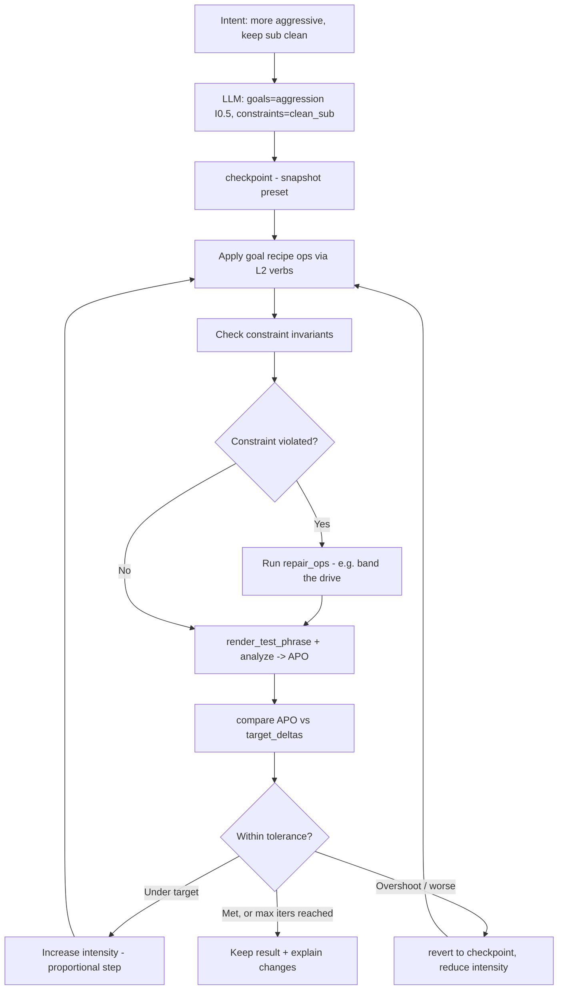

# Serum Semantic Control — Intent → Preset Spec

**Status:** idea / design exploration
**Extends:** `SERUM_LLM_CONTROL_SPEC.md` (control surfaces/tiers), `../AUDIO_AWARENESS_SPEC.md` (perception loop)
**Goal:** Let a user say *"make this Serum bass more aggressive"*, *"more animated"*, *"keep the sub clean"*,
*"make the drop bass hit harder"* — and have an LLM modify a Serum preset in a **musically useful, verifiable** way.

---

## 0. The one rule

> **Never hand the LLM 1,000 raw parameters.** Give it a small set of producer-shaped verbs that compose
> upward into musical intent, and make every subjective request **measurable** through a render→analyze loop.

A flat param list produces confident nonsense. A **layered, bounded, audited** surface produces useful edits.

---

## 1. The four layers

```
L4  Natural-language intent        "make the drop bass hit harder"
        ↓  (LLM planner: decompose into goals + constraints)
L3  Recipe layer                   apply_recipe("impact", I=0.6, respect=["clean_sub"])
        ↓  (musical transforms: ordered, intensity-scaled operations)
L2  Module-aware operations        set_knob / drag_mod / set_fx_knob / select_option / set_macro
        ↓  (UI verbs the way producers think)
L1  Low-level safe primitives      set_param(registry_key, value) — clamped to safe_range
        ↓  (registry resolves key → backend id)
        backend: Ableton LiveAPI param | VST3 param id | Serum preset JSON
```

Plus an **audition/analysis loop** wired into L3 (recipes verify themselves) — without it the LLM is guessing.

| Layer | Who calls it | Reasons in terms of | Example |
|------|--------------|---------------------|---------|
| L4 | the user | feelings/genre words | "more animated" |
| L3 | the LLM (mostly) | musical transforms + intensity | `apply_recipe("animation", 0.5)` |
| L2 | the LLM (precision) | knobs, mods, options | `drag_mod("LFO 1","Filter Cutoff",-0.30)` |
| L1 | the system | normalized values | `set_param("filter_cutoff", 0.41)` |

**Key: the LLM lives at L3–L2, never L1.** It speaks recipes and UI verbs; the system handles IDs and safety.

---

## 2. The operations layer (L2) — UI verbs

The canonical tool surface. Every op resolves through the registry, clamps to `safe_range`, snapshots the
prior value for undo, and returns the value actually applied.

```ts
// continuous knobs (absolute or relative)
set_knob(module, knob, value)              // set_knob("OSC A","Warp Amount",0.61)
nudge_knob(module, knob, delta)            // nudge_knob("FILTER","Resonance",+0.08)
set_fx_knob(fx, knob, value)               // set_fx_knob("Distortion","Drive",0.55)
set_macro(name, value)                     // set_macro("intensity",0.7)

// enumerated choices
select_option(module, param, option)       // select_option("OSC A","Warp Mode","FM from B")
                                           // select_option("FILTER","Type","MG Low 24")

// modulation matrix (first-class — this is how "animation" happens)
drag_mod(source, dest, depth)              // drag_mod("LFO 1","Filter Cutoff",-0.30)
set_mod_rate(source, value)                // set_mod_rate("LFO 1",0.45)
clear_mod(source, dest)

// audition + analysis (the loop)
send_midi_note(note, velocity, durationMs)
render_test_phrase(style, root, bpm)       // "drop_bass" | "reese" | "sustained" | "stab"
render_before_after()
analyze(audio)                             // -> Audio Perception Object (see awareness spec)
detect_harshness(audio) / detect_muddiness(audio) / detect_weak_sub(audio)
compare_renders(before, after)
checkpoint() / revert(checkpoint)          // safety: undo a bad edit wholesale
```

**Modulation is a primitive, not an afterthought.** "More animated" is fundamentally a mod-matrix and
LFO/envelope operation, so `drag_mod` / `set_mod_rate` must be first-class.

---

## 3. The control registry (extended)

Your schema, extended with the fields the operations and loop layers actually need: response curve, op kind,
enum options, perceptual step size, which audio bands a knob tends to move (for closed-loop attribution), and
whether it's currently exposed in Ableton's Configure surface.

```jsonc
{
  "osc_a_warp_amount": {
    "display_name": "OSC A Warp Amount",
    "module": "OSC A", "knob": "Warp Amount",
    "kind": "continuous",
    "backend": { "ableton_parameter_name": "A Warp", "vst3_parameter_id": 384, "serum_json_path": "osc.a.warp.amt" },
    "normalized_range": [0, 1], "safe_range": [0.05, 0.85], "default": 0.25,
    "response_curve": "linear", "relative_step": 0.08,
    "affects_bands": ["highmid_2k_6k", "air_6k_20k"],
    "tags": ["oscillator","harmonics","fm","movement-sensitive"],
    "exposed_in_ableton": true
  },
  "filter_cutoff": {
    "display_name": "Filter Cutoff", "module": "FILTER", "knob": "Cutoff",
    "kind": "continuous",
    "backend": { "ableton_parameter_name": "Filter Cutoff", "vst3_parameter_id": 219, "serum_json_path": "filter.cutoff" },
    "normalized_range": [0, 1], "safe_range": [0.12, 0.88], "default": 0.5,
    "response_curve": "log", "relative_step": 0.06,
    "affects_bands": ["lowmid_120_400","mid_400_2k","highmid_2k_6k"],
    "tags": ["filter","brightness","movement","tone"],
    "exposed_in_ableton": true
  },
  "osc_a_warp_mode": {
    "display_name": "OSC A Warp Mode", "module": "OSC A", "param": "Warp Mode",
    "kind": "enum",
    "options": { "Off":0, "Sync":1, "Bend":2, "FM from B":6, "AM from B":7 },
    "backend": { "ableton_parameter_name": "A WarpMode", "vst3_parameter_id": 383 },
    "tags": ["oscillator","character"], "exposed_in_ableton": true
  }
}
```

**Registry design rules**
- LLM addresses **keys + friendly labels**, never raw IDs.
- `safe_range` is enforced at L1 — the LLM cannot drive a param into self-destruction.
- `response_curve` makes nudges *perceptually* even (cutoff is log; a flat +0.1 isn't musically uniform).
- `affects_bands` lets the loop **attribute** a measured spectral change back to the knob that caused it.
- `exposed_in_ableton` ties directly to Configure Mode (§7).

---

## 4. The recipe layer (L3) — where musical knowledge lives

A recipe is a **named, intensity-scaled, constraint-aware transform** with a measurable target. This is the
missing middle that turns "aggressive" into knob moves *and* knows what success sounds like.

```jsonc
{
  "id": "aggression",
  "aliases": ["aggressive","harder","meaner","dirtier","angrier","nastier"],
  "intent": "more bite/edge without losing definition",
  "intensity": true,                         // I in [0,1] scales magnitudes
  "target_deltas": {                          // success criteria in APO terms
    "band_2k_4k_db": "+2..+5", "harmonic_density": "+",
    "crest_factor": "-1..-3", "centroidHz": "+"
  },
  "operations": [                             // relative nudges, scaled by I
    { "op": "set_fx_knob", "fx": "Distortion", "knob": "Drive", "delta": "+0.15*I" },
    { "op": "ensure_min",  "fx": "Distortion", "knob": "Mix", "min": 0.30 },
    { "op": "nudge_knob",  "module": "FILTER", "knob": "Resonance", "delta": "+0.08*I", "cap": 0.70 },
    { "op": "nudge_knob",  "module": "OSC A",  "knob": "Warp Amount", "delta": "+0.10*I" },
    { "op": "nudge_knob",  "module": "FILTER", "knob": "Drive", "delta": "+0.12*I" }
  ],
  "respects": ["clean_sub","mono_safe","headroom"],
  "side_effects": ["adds low harmonics -> check sub", "raises true-peak -> check headroom"],
  "verify": ["detect_harshness","analyze_low_end","analyze_loudness"]
}
```

```jsonc
{
  "id": "animation",
  "aliases": ["more animated","movement","alive","evolving","modulated"],
  "intent": "introduce motion over time without sounding random",
  "intensity": true,
  "target_deltas": { "spectral_flux": "+", "temporal_variance": "+" },
  "operations": [
    { "op": "drag_mod", "source": "LFO 1", "dest": "Filter Cutoff", "depth": "+0.25*I" },
    { "op": "set_mod_rate", "source": "LFO 1", "value": "tempo_sync:1/8" },
    { "op": "drag_mod", "source": "LFO 2", "dest": "OSC A Warp Amount", "depth": "+0.15*I" },
    { "op": "select_option", "module": "LFO 1", "param": "Shape", "value": "Triangle" }
  ],
  "respects": ["clean_sub","mono_safe"],
  "verify": ["analyze_spectrum","compare_renders"]
}
```

**Recipes are data, not code.** They can be human-authored, version-controlled, and **refined by the closed
loop** (if a recipe consistently overshoots, its default magnitudes get tuned). They compose: an intent can
fire several recipes with per-recipe intensity.

---

## 5. Constraints as invariants (the part "keep the sub clean" needs)

Three of the four example requests are **goals**; *"keep the sub clean"* is a **constraint** — an invariant that
must hold *while other recipes run*, not a one-shot edit. Model it separately.

```jsonc
{
  "id": "clean_sub",
  "priority": "high",                         // constraints outrank goals
  "intent": "controlled, mono, undistorted low end",
  "invariants": [
    { "metric": "mono_correlation_below_120hz", "must": ">=0.9" },
    { "metric": "sub_30_60_db",                  "must": "within_target ±2" },
    { "metric": "intermod_below_120hz",          "must": "low" }
  ],
  "repair_ops": [                              // run only if an invariant is violated
    { "op": "set_knob", "module": "SUB", "knob": "Direct Out", "ensure": true },
    { "op": "select_option", "fx": "Distortion", "param": "Band", "value": "High only" },
    { "op": "drag_mod", "source": "Distortion", "dest": "sub_band", "depth": 0 }
  ]
}
```

**Application order each iteration:** apply goal recipes → measure → check every active constraint's invariants
→ if violated, run that constraint's `repair_ops` → re-measure. Constraints have veto power: a goal edit that
breaks `clean_sub` is partially rolled back or rerouted (e.g. multiband the distortion) rather than kept.

This is exactly why distortion-for-aggression and clean-sub can **coexist**: the system bands the drive above
120 Hz when the constraint is active.

---

## 6. The closed loop (with convergence control)



**Convergence guardrails (so it doesn't tweak forever):**
- **Proportional stepping** — adjust intensity by `(target − measured)/sensitivity`, not fixed jumps.
- **Damping** — shrink step each iteration to avoid oscillation around the target.
- **Iteration cap** — e.g. 4 renders; return best-so-far if not converged.
- **Tolerance band** — "good enough" window per metric; stop when all goals inside and all constraints held.
- **Monotonic gate** — never accept an iteration that worsens a previously-satisfied constraint.

---

## 7. Ableton Configure Mode = a designed control surface (feature, not bug)

Live exposes plugin params for automation, and for big plugins the user curates them via **Configure Mode**.
Lean into it: the **curated surface *is* the registry's `exposed_in_ableton` set.**

- Ship a **Serum control-surface artifact**: a `.adv`/template + a Configure-Mode mapping that exposes exactly
  the ~30 curated params below.
- At startup, **verify exposure**: the system reads the device's exposed params and asserts every registry key
  with `exposed_in_ableton:true` is present; if not, it tells the user which to add (or, via M4L, the broader
  LiveAPI surface may already cover them).
- Version the surface with the registry so it survives Serum updates.

**Curated surface (the bounded ~30):**
```
OSC A   : wavetable pos, warp mode, warp amount, level, unison, detune
OSC B   : level, octave, warp amount
SUB     : level, octave, direct out
FILTER  : type, cutoff, resonance, drive, mix
LFO 1   : rate, depth→wavetable pos, depth→filter cutoff, shape preset
FX      : dist drive, dist mix, comp gain, multiband, EQ low-mid, EQ high-mid, dimension mix
MACROS  : intensity, movement, dirt, width
```
Macros are gold: map Serum's 4 macros to **intensity / movement / dirt / width** so many recipes reduce to a
single, safe, patch-aware knob move.

---

## 8. The four requests, worked end-to-end

| Request | L4 decomposition | L3 recipes | Key L2 ops | Loop checks |
|--------|------------------|-----------|-----------|-------------|
| **"more aggressive"** | goal: aggression | `aggression(I)` | dist Drive↑, Reso↑, Warp↑ | `detect_harshness` not excessive; headroom ok |
| **"more animated"** | goal: animation | `animation(I)` | `drag_mod(LFO1→Cutoff)`, `set_mod_rate 1/8`, `drag_mod(LFO2→Warp)` | `spectral_flux`↑ vs before; not random/noisy |
| **"keep the sub clean"** | constraint | `clean_sub` invariant | SUB Direct Out, band distortion **High only** | mono<120Hz ≥0.9; sub 30–60 in band |
| **"make the drop hit harder"** | goal: impact (+context) | `impact(I)` | faster amp attack, transient/peak macro, +200–400Hz body, comp for density | `analyze_low_end` punch↑; true-peak safe; not muddy |

Notes:
- *"hit harder"* is **context-sensitive**: in a drop it means transient impact + low-mid body + perceived
  loudness, balanced against the kick — so `impact` should optionally read the surrounding mix (kick masking)
  before deciding whether to push 60 Hz or 200 Hz.
- *"more aggressive"* + *"keep sub clean"* together = aggression goal **with** clean_sub constraint, which
  forces the multiband-distortion repair path. The constraint is what makes the combination musical.

---

## 9. Explainability & safety (non-negotiable for trust)

- **Every op logged** with before/after value, the recipe/intent that caused it, and the **measured audio
  effect** ("Drive +0.15 → +2.1 dB @ 2.5 kHz, crest −1.4"). Producers trust edits they can read.
- **Before/after audio** always retained; `compare_renders` surfaced to the user.
- **One-click revert** via `checkpoint`/`revert`; whole-session as one undo via the SDK transaction.
- **Hard safety rails**: true-peak/DC/clip monitoring each iteration; `safe_range` clamps; constraint veto.
- **No silent structural edits**: recipes only touch the curated surface; wavetable/routing structure comes
  from preset templates (per `SERUM_LLM_CONTROL_SPEC.md` Tier 2), never invented blindly.

---

## 10. Build order

1. **Registry + L2 verbs** over the curated ~30 params (M4L LiveAPI backend), with clamping + undo snapshots.
2. **Configure-Mode surface artifact** + startup exposure verification.
3. **Audition + analysis** wired to the Perception Service (APO, `detect_*` analyzers).
4. **3–4 seed recipes** (aggression, animation, impact) + **clean_sub constraint**, hand-authored.
5. **Closed loop** with convergence guardrails; LLM planner at L4 decomposing intent → recipes + constraints.
6. **Recipe refinement**: log outcomes, auto-tune recipe magnitudes; grow the recipe/constraint library.
7. **Template integration** for structural changes (Tier 2) and offline JUCE rendering for speed/batch.

---

## 11. Reusability

The whole stack is synth-agnostic above L1. Swap Serum for any plugin by supplying a new **registry +
curated surface + recipe/constraint library**; the LLM planner, operations verbs, perception loop, and
convergence engine are unchanged. Recipes and constraints are portable musical knowledge — the synth is a
pluggable backend, exactly as in the architecture spec's shared tool registry.
```
intent  →  [ planner ]  →  recipes + constraints  →  [ ops verbs ]  →  [ registry ]  →  any synth backend
                                   ↑__________ audition + analyze loop __________↓
```
