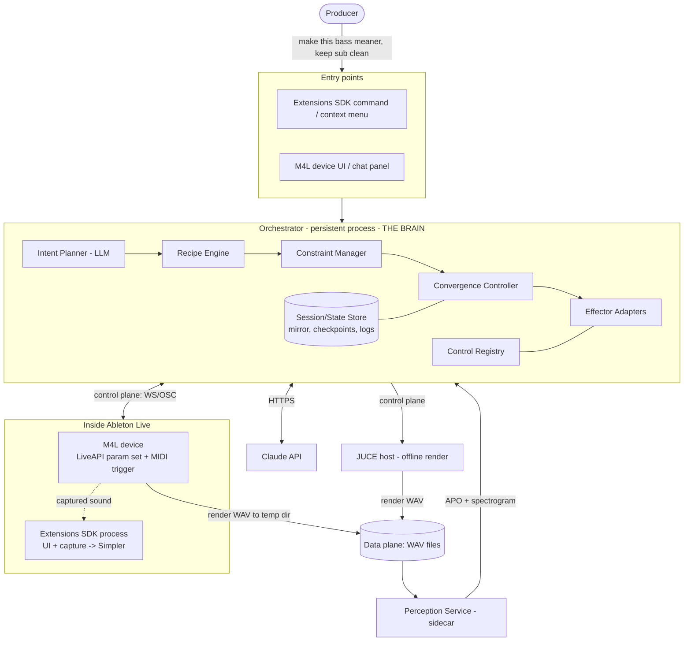
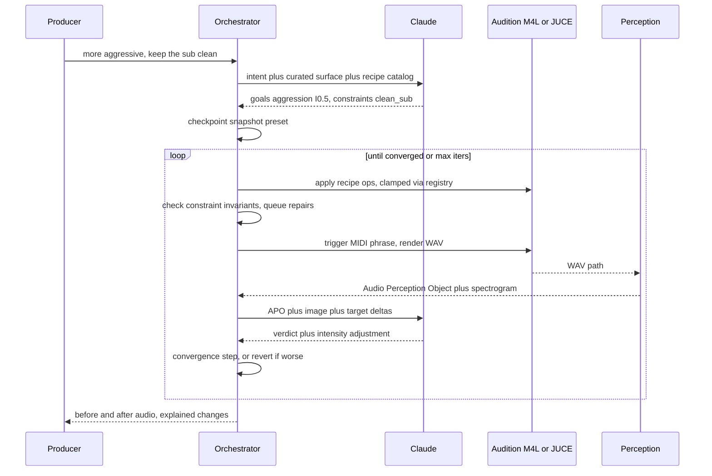

# System Architecture — AI Serum / Sound-Design Control

**Status:** idea / design exploration — high-level architecture
**Ties together:** `SERUM_SEMANTIC_CONTROL_SPEC.md` (intent→preset), `SERUM_LLM_CONTROL_SPEC.md` (control tiers),
`../AUDIO_AWARENESS_SPEC.md` (perception)
**This document:** the top-level shape. Component internals are drilled in separate dives.

---

## 0. The decision that shapes everything

The semantic-control loop (render → analyze → revise) is **long-lived and stateful**. But the Ableton
Extensions SDK is **command-triggered and explicitly not designed to run persistently in the background**
(see SDK *Introduction → "What Extensions Aren't Designed For"*).

> **Therefore the brain/loop runs in a persistent Orchestrator process *outside* the SDK.**
> The Extensions SDK is one **client/effector** (UI commands + final capture), not the host of the intelligence.

Everything below follows from this: a **decoupled orchestrator** topology, not an SDK-centric one.

---

## 1. Two planes

| Plane | Carries | Transport | Sees the LLM? |
|------|---------|-----------|---------------|
| **Control plane** | intents, op calls, APOs, decisions, logs | WebSocket / OSC (msgs) | yes — but only summaries |
| **Data plane** | rendered audio | files on disk (temp dir) | **never** raw audio |

The LLM only ever sees **APO summaries + spectrogram images**, never PCM. Heavy audio stays on disk and is
referenced by path. This separation is what makes the system fast, debuggable, and synth-agnostic.

---

## 2. Topology



**Three reaches into Live, each for what it's best at:**
- **M4L** — live parameter control of Serum + MIDI triggering for auditioning (persistent while Live is open).
- **Extensions SDK** — user-facing commands, progress UI, and capturing the final result into a Simpler/clip.
- **JUCE** — optional offline host for fast/batch rendering or full-state patch control.

---

## 3. Component responsibilities

| Component | Process | Owns |
|---|---|---|
| **Intent Planner** | Orchestrator | NL → `{goals[], constraints[], intensities}`; reasons at recipe level |
| **Recipe Engine** | Orchestrator | recipe → ordered L2 ops, intensity-scaled |
| **Constraint Manager** | Orchestrator | invariant checks, repair ops, veto over goals |
| **Convergence Controller** | Orchestrator | loop driver: proportional stepping, damping, iteration cap, tolerance gate |
| **Control Registry** | Orchestrator | friendly name ↔ backend id; safe_range clamp; response curves |
| **Effector Adapters** | Orchestrator | one interface, swappable backends (M4L / JUCE / SDK) |
| **Audition Engine** | M4L / JUCE | apply params, trigger MIDI phrase, render WAV to disk |
| **Perception Service** | Sidecar | WAV → Audio Perception Object + spectrogram PNG |
| **Session/State Store** | Orchestrator | preset-state mirror, checkpoint stack, op log, render/APO cache |
| **Capture / UI** | Extensions SDK | commands, progress dialogs, import result → Simpler instrument |

**Boundary rule:** the LLM only calls **L3 recipes / L2 verbs**; adapters and the registry handle backend IDs
and safety. Swapping Serum for another synth touches only the registry + recipe library + an adapter.

---

## 4. Request lifecycle (one intent)



---

## 5. Stable contracts (the swappable seams)

Three interfaces stay fixed while everything behind them flexes:

1. **Op/Tool schema** (control plane) — the L2 verbs + L3 recipe calls the LLM emits.
2. **Audio Perception Object** (perception output) — analyzer-agnostic audio summary.
3. **Control Registry** (name ↔ backend) — synth-agnostic addressing + safety.

Hold these stable and you can swap: the LLM provider, the analyzer stack, the synth, and the render backend —
independently.

---

## 6. Transport choices (first pass)

- **Control plane:** WebSocket between Orchestrator ↔ M4L (Node for Max) — bidirectional, low-latency, JSON.
  OSC is a viable alternative (native to the M4L/audio world) if message shapes stay simple.
- **Data plane:** plain files in the extension/JUCE **temp directory**; pass paths, not bytes.
- **External agents (optional):** expose the Orchestrator's op/recipe tools over **MCP** so Claude Code / Desktop
  can drive the same system the in-Live UI does — same tool registry, different client.

---

## 7. Deployment shapes

| Shape | Orchestrator runs as | Best for |
|------|----------------------|----------|
| **Embedded** | Node child process spawned by an M4L device | single-user, all-local, simplest |
| **Local service** | standalone localhost daemon | multiple entry points (SDK + M4L + chat), reuse |
| **Hybrid** | local service + optional JUCE render farm | batch sound-design, speed |

Recommended start: **Local service** — it cleanly serves the SDK command, the M4L UI, and an MCP client at
once, and keeps the persistent loop out of the SDK process where it doesn't belong.

---

## 8. What we drill into next

This is the top level. Natural follow-up dives, each its own pass:

1. **Orchestrator internals** — the convergence controller's control law (stepping/damping/tolerance).
2. **Control plane protocol** — exact message shapes for ops, APO, decisions; error/timeout handling.
3. **M4L adapter** — LiveAPI param mapping, Configure-Mode surface verification, MIDI auditioning.
4. **Perception Service** — analyzer stack, APO computation, the `detect_*` metrics.
5. **State & explainability** — checkpoint model, op log schema, before/after capture.
6. **Failure modes** — plugin not exposed, render timeout, non-convergence, constraint deadlock.
```
